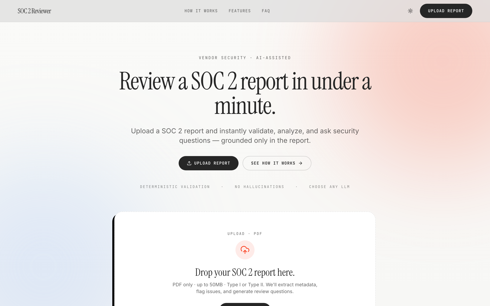
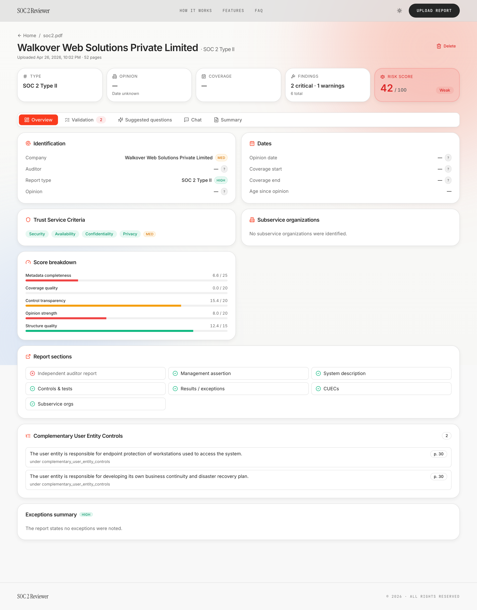
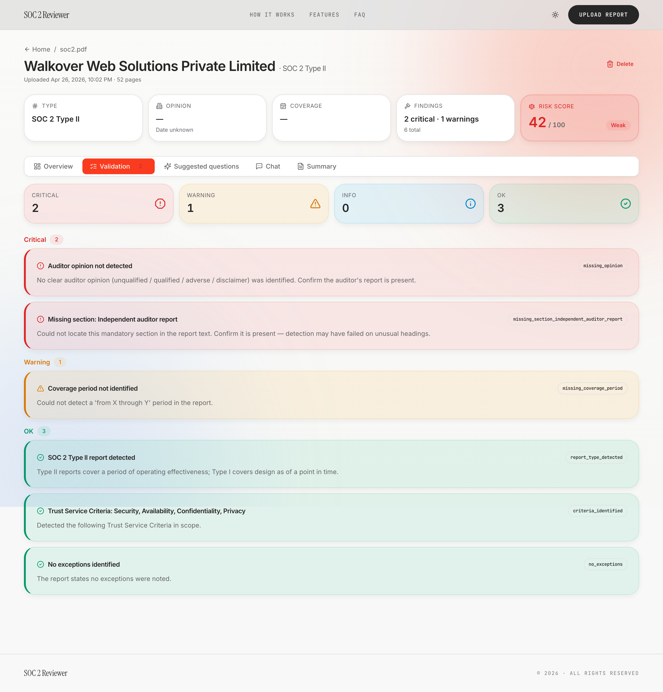
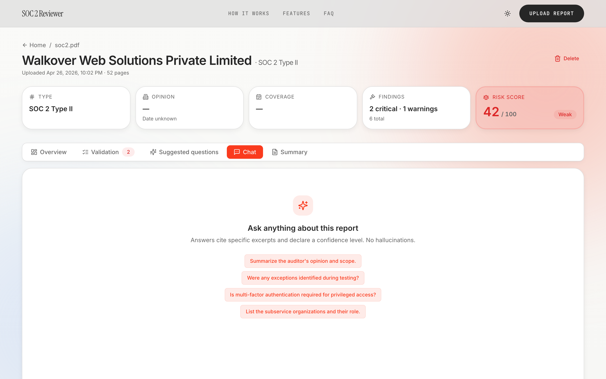
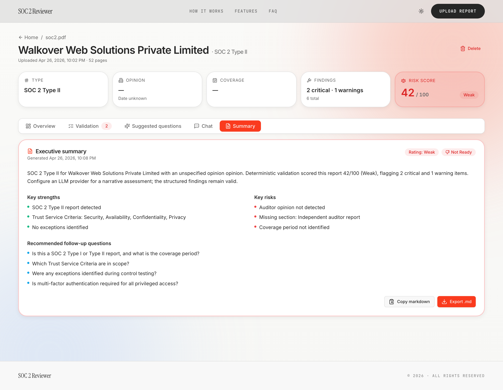

<div align="center">

<br />

# SOC 2 Reviewer

#### Read a SOC 2 report in under a minute.

A vendor-security review tool that mechanically validates a SOC 2 PDF, extracts
every field with a confidence score, and lets you ask grounded questions of the
report — all running locally on your laptop.

<sub>Next.js 15 · FastAPI · PostgreSQL + pgvector · Ollama · Docker</sub>

<br />



</div>

<br />
<br />

## What it does

Drop a SOC 2 PDF onto the page. Five seconds later you have:

- A **dashboard** of every metadata field — company, auditor, opinion, coverage
  window, trust-service criteria, subservices, CUECs — each tagged with a
  confidence pill and a hover-able evidence excerpt.
- A **risk score** out of 100 across five weighted categories — Metadata
  completeness, Coverage quality, Control transparency, Opinion strength,
  Structure quality — with the reasoning surfaced inline.
- A **validation report** that flags the things vendor reviewers actually
  care about: missing sections, expired coverage, qualified opinions, undisclosed
  subservices, exceptions that need review.
- A **chat** that answers questions grounded in the report's text — every answer
  cites the exact page and excerpt, every retrieval pass declares its own
  confidence level. No hallucinations.

Everything runs locally by default. Embeddings are computed in-process by
`sentence-transformers`. Chat runs against a sibling Ollama container. Swap to
OpenAI / Anthropic / Groq with a single env var if you'd rather.

<br />

## See it

<table>
<tr>
<td width="50%" valign="top">

**Dashboard**

Every extracted field carries a confidence pill (`high` / `med` / `low` / `?`).
Hover for the method, page number, and the literal text that produced the
match. The score breakdown is a five-bar visual that mirrors the risk number.

</td>
<td width="50%">



</td>
</tr>
<tr>
<td width="50%">



</td>
<td width="50%" valign="top">

**Validation**

Findings are ranked critical → warning → info → ok, each with the rule code
that fired and a one-line explanation. No noisy "your PDF has 47 pages"
non-findings.

</td>
</tr>
<tr>
<td width="50%" valign="top">

**Chat**

Suggested questions are pre-cached on upload, so the chat tab is responsive
the moment the report goes ready. Answers cite specific chunks; citations
link back to the page they came from.

</td>
<td width="50%">



</td>
</tr>
<tr>
<td width="50%">



</td>
<td width="50%" valign="top">

**Executive summary**

A one-pager you can copy as Markdown or export to share with your team —
strengths, risks, and recommended follow-ups derived from the deterministic
findings, not invented prose.

</td>
</tr>
</table>

<br />

## Quickstart

```bash
git clone https://github.com/vidit135g/soc2-reviewer.git
cd soc2-reviewer
docker compose --profile ollama up -d --build
```

Then in another terminal, pull the local model once:

```bash
docker exec -it soc2-ollama ollama pull llama3.2:3b
docker compose restart backend
```

Open **http://localhost:3000** and drop a PDF.

If you'd rather use a hosted LLM, drop the `--profile ollama` flag and add an
API key:

```bash
# backend/.env
LLM_PROVIDER=anthropic       # or openai / groq
ANTHROPIC_API_KEY=sk-ant-...
```

<br />

## How it works

```
┌──────────┐   PDF    ┌──────────────┐   text   ┌──────────────┐
│  Upload  │ ────────▶│   Parser     │ ────────▶│  Extraction  │
│  (zone)  │   bytes  │ PyMuPDF +    │  + page  │   pipeline   │
└──────────┘          │ pdfplumber   │  marks   │              │
                      └──────────────┘          │  rules → LLM │
                                                │  (only on    │
                                                │  low-conf    │
                                                │  fields)     │
                                                └──────┬───────┘
                                                       │
                                          ┌────────────▼────────────┐
                                          │   Confidence engine     │
                                          │  {value, conf, method,  │
                                          │   evidence, page}       │
                                          └────────────┬────────────┘
                                                       │
                              ┌────────────────────────┼────────────────────────┐
                              ▼                        ▼                        ▼
                      ┌──────────────┐         ┌──────────────┐         ┌──────────────┐
                      │ 5-category   │         │ Embeddings   │         │  Validation  │
                      │ weighted     │         │ pgvector +   │         │  findings    │
                      │ scoring      │         │ HNSW index   │         │              │
                      └──────────────┘         └──────┬───────┘         └──────────────┘
                                                      │
                                              ┌───────▼────────┐
                                              │  RAG chat      │
                                              │  (citations)   │
                                              └────────────────┘
```

The pipeline is deliberately rules-first and LLM-second.

1. **Rules run first.** Per-field extractors look for deterministic anchors —
   the auditor's letterhead, "for the period X through Y", a `Complementary
   User Entity Controls` heading, ISIN-style trust-criterion codes. Each
   returns a `FieldExtraction { value, confidence, method, evidence, page }`.
2. **The LLM only runs on holes.** Whitelisted fields whose confidence came
   back `low` or `none` get a single LLM pass. The LLM is forbidden from
   overriding `high` or `medium` rule matches — that would be a regression
   risk (paraphrasing a correct regex answer).
3. **Scoring is transparent.** Five weighted categories, summed to a 0–100
   integer with a `Strong` / `Moderate` / `Weak` / `Unknown` rating. An
   adverse or disclaimer opinion forces `Weak` regardless of the number.
4. **Chat is grounded.** Retrieval pulls top-k chunks from pgvector; the
   prompt injects them with line numbers; the LLM is instructed to refuse
   anything that isn't supported by the excerpts. Confidence is parsed from
   the answer and surfaced in the UI.

<br />

## Configuration

All config lives in `backend/.env`. Sensible defaults are baked in — you only
need to override the values you care about.

| Variable | Default | What |
|---|---|---|
| `LLM_PROVIDER` | `ollama` | `openai` / `anthropic` / `groq` / `ollama` / `stub` |
| `LLM_MODEL` | `llama3.2:3b` | Model name passed to the active provider |
| `LLM_TIMEOUT_SECONDS` | `180` | Hard ceiling on a single completion |
| `CHAT_MAX_TOKENS` | `500` | Per-answer token budget |
| `EMBEDDING_PROVIDER` | `local` | `local` (BGE-small) / `ollama` / `openai` |
| `SEMANTIC_AUGMENTATION` | `true` | Whether the LLM fills low-confidence rule misses |
| `OPENAI_API_KEY` / `ANTHROPIC_API_KEY` / `GROQ_API_KEY` | _(unset)_ | Only needed if matching `LLM_PROVIDER` |
| `MAX_UPLOAD_MB` | `50` | Reject larger PDFs at the API |
| `TOP_K` | `6` | Retrieval depth for chat |

Without an API key for the matching provider, the backend falls back to a
deterministic stub provider. The UI degrades gracefully — deterministic findings
remain valid; chat returns a canned "configure an LLM" message.

<br />

## The confidence engine

Every metadata field surfaced to the UI carries four pieces of provenance:

```ts
{
  value: "ACME WIDGETS, INC.",
  confidence: "high",          // high / medium / low / none
  method:     "rule_font",     // which extractor produced the value
  evidence:   "ACME WIDGETS, INC. (the \"Company\")…",
  page_number: 1
}
```

`confidence` is **earned**, not declared:

- **`high`** — a deterministic anchor matched (cover-page big-font + entity
  suffix; `for the period X through Y` regex; known auditor in the
  `KNOWN_AUDITORS` list).
- **`medium`** — heuristic-with-quibbles (title-case line; loose date range;
  generic `<Name>, LLP` suffix).
- **`low`** — we guessed; the LLM stage attempts to replace.
- **`none`** — the rule explicitly couldn't find anything; the LLM stage
  attempts to fill.

The pill in the UI is colour-coded by level and the hover tooltip exposes
the method, page, and evidence excerpt — so a security reviewer can audit any
extracted value without opening the PDF.

<br />

## Project layout

```
soc2-reviewer/
├── backend/              # FastAPI app (Python 3.12)
│   ├── app/
│   │   ├── api/          # /upload, /chat, /report, /summary…
│   │   ├── extraction/   # per-field extractors + scoring
│   │   ├── parsers/      # PDF -> structured pages
│   │   ├── services/     # report, chat, retrieval, llm, summary
│   │   ├── validators/   # thin layer over the extraction pipeline
│   │   └── models/       # Pydantic schemas + SQLAlchemy ORM
│   └── Dockerfile
├── frontend/             # Next.js 15 app router (TypeScript)
│   ├── app/              # routes
│   ├── components/       # dashboard, chat, overview, summary, …
│   └── Dockerfile
├── docs/
│   ├── ARCHITECTURE.md
│   ├── DEPLOYMENT.md
│   └── screenshots/
└── docker-compose.yml    # postgres + backend + frontend (+ optional ollama)
```

<br />

## Development

```bash
# Run backend locally (without docker) — assumes a Postgres on :5432
cd backend
python -m venv .venv && source .venv/bin/activate
pip install -r requirements.txt
uvicorn app.main:app --reload --port 8000

# Run frontend locally
cd frontend
npm install
npm run dev
```

Type checks and lint:

```bash
cd frontend && npm run typecheck && npm run lint
```

If a redeploy goes wrong, the recovery cheat-sheet:

```bash
docker compose down            # keeps the postgres + model-cache volumes
docker compose up -d --build   # rebuild + restart everything
docker compose logs -f         # tail the boot sequence
```

<br />

## What's not in scope (yet)

- Multi-tenant auth — anyone with the URL can upload + read everything.
- A streaming chat surface — answers come back as a single shot.
- Historical diffs across SOC 2 vintages — coming, see `docs/ARCHITECTURE.md`.
- Mobile layout — the dashboard assumes ≥ 1024px wide.

<br />

## License

MIT — see [`LICENSE`](LICENSE).

<br />

<div align="center">
  <sub>Built for vendor security reviewers tired of reading 200-page PDFs by hand.</sub>
</div>
